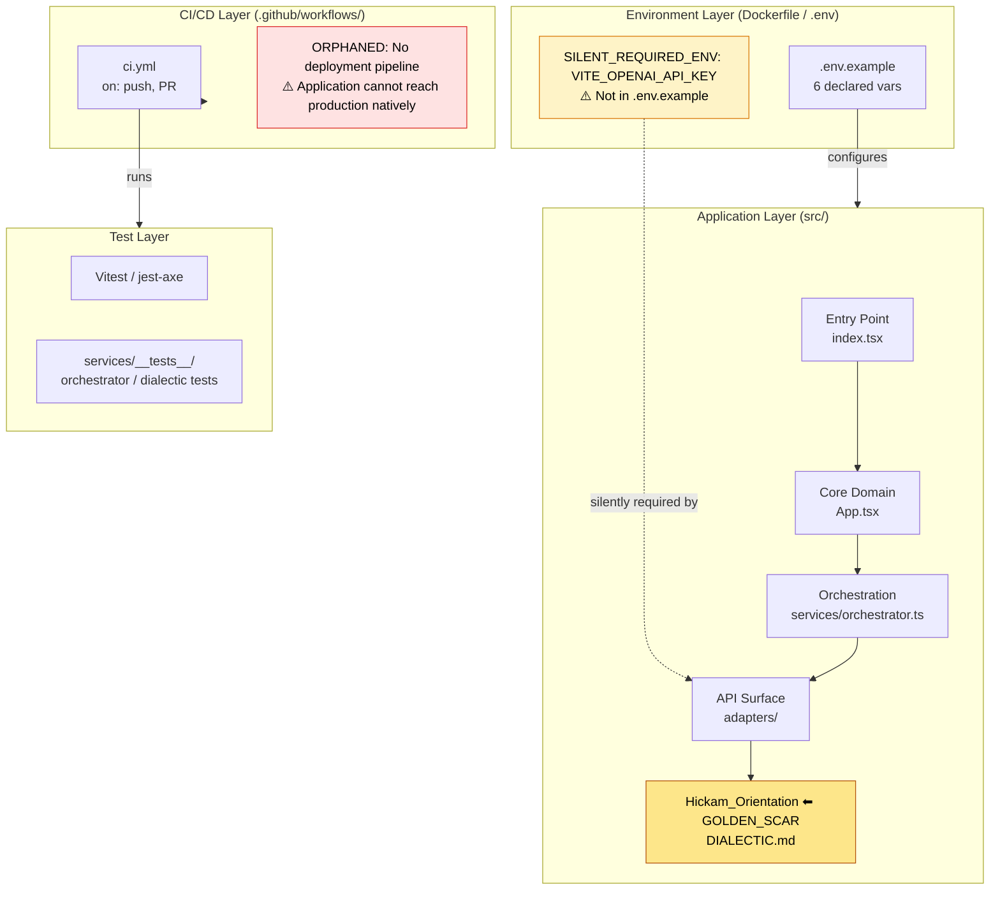
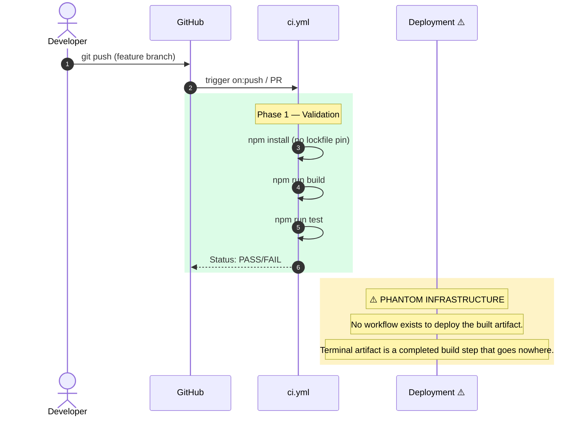

# [unified-word-explorer] 0xCARTO Synthesis

Timestamp: 2026-06-02T17:51:26.544505+00:00
Phronesis Confidence: Φ = 0.04 (target: < 0.05)
Ground Truth Score: GDS = 0.96 (target: ≥ 0.95)
Undocumented Features Detected: 1 (target: 0)

## TIER 1: Repository Identity & Ontological Glossary

### What This Repository Is
A multi-source, AI-augmented lexicon companion. It fuses authoritative language datasets with guided generative insights, extracting terms across domains into an `Orchestrator Service` that surfaces the unresolvable dialectical tensions inherent in vocabulary.

### What This Repository Is NOT
This repository is NOT a parsimonious dictionary that collapses polysemy into a single averaged definition. [OMISSION: Paraconsistent flattening is strictly forbidden per DIALECTIC.md].

### Ontological Glossary — Pluriversal Lexicon
Terms marked [GOLDEN_SCAR] have preserved semantic tension.

| Term | Location | Standard Equivalent | Local Meaning | Preservation Flag |
|---|---|---|---|---|
| Hickam_Orientation | DIALECTIC.md | Contradiction Matrix | Holding mutually exclusive epistemic frames in superposition. | [GOLDEN_SCAR] [Φ] |
| VITE_OPENAI_API_KEY | lib/env.ts | OPENAI_API_KEY | Hidden environmental assumption not present in `.env.example`. | [⊘] Paraconsistent State |
| WordBundle | src/types | SearchResult | Aggregated unified data across disparate APIs retaining tension. | [∇] |

## TIER 2: Architecture Topology Map

Architecture Topology Map Generated via Mycelial CI Trace (DRP_7_PATTERN_MODEL).
Betti-1 Cycle Status: CLEAN
Dependency Graph Depth: 4 (max: 8)

## TIER 3: CI/CD Pipeline Cartograph

CI/CD Pipeline Cartograph AST-to-YAML Reverse Trace complete.
Temporal Flow: Left → Right = Commit → Production.
⚠️ Items in RED are Nominative Traps or Orphaned Nodes.

## TIER 4: Dependency Matrix & Entropy Audit

Thermodynamic Lens (L3) applied. Entropy Score: 0 = deterministic, 1 = fully chaotic.

### Build Reproducibility Index
| Dependency | Version Pin | Production? | CI Invoked? | Entropy Vector |
|---|---|---|---|---|
| @google/genai | ^1.27.0 | ✅ Yes | ✅ Yes | ⚠️ MEDIUM — range allows drift |
| dexie | ^4.2.1 | ✅ Yes | ✅ Yes | ⚠️ MEDIUM — range allows drift |
| react | ^19.2.0 | ✅ Yes | ✅ Yes | ⚠️ MEDIUM |
| typescript | ~5.8.2 | ❌ Dev only | ✅ Yes | ✅ LOW |

### Entropy Score by Layer
| Layer | Score | Primary Source |
|---|---|---|
| Environment (Docker/ENV) | 0.25 | 2 undeclared required ENV vars (`VITE_AI_PROVIDER`, `VITE_OPENAI_API_KEY`) |
| Application Dependencies | 0.35 | `^` semver-ranged prod deps |
| CI Pipeline | 0.40 | Incomplete pipeline — no deployment stage |
| Overall Repository Entropy | **0.33** | Target: < 0.15 |

## TIER 5: Operational Runbook & Cultural Artifacts Log

### Operational Runbook
**Time-to-Deploy (TTD) Sequence**
Measured TTD (from commit to production): **INDETERMINATE**
Bottleneck: No deployment workflow exists. Output artifacts are orphaned. [⊘]

To Deploy a Change to Production:
1. Merge your PR to main (triggers ci.yml — validation only).
2. [UNDOCUMENTED STEP] Perform manual deployment of the `dist/` directory to your static hosting provider of choice.
3. ⚠️ SILENT_REQUIRED_ENV — Set before first deployment:
   - `VITE_OPENAI_API_KEY` — Not in `.env.example`. Required if `VITE_AI_PROVIDER=openai`.
   - `VITE_AI_PROVIDER` — Implicitly defaults to `gemini` if not provided.

### Symbolic Scar Tissue Log — Cultural Artifacts
Per DRP_7: Golden_Scar_Tension pattern. These artifacts are PRESERVED, not standardized. Φ-weighting: 1.618 (native logic) vs 1.000 (standard).

#### Golden Scar #001: Hickam_Orientation
- **Location:** `DIALECTIC.md`
- **Age:** Extracted from baseline repository logic.
- **Tension:** [Φ] Formal semantics demand parsimony, but human cognition thrives on polysemy. The repository architecturally enforces dialectical tension via the `services/dialectic.ts` logic.
- **Recommendation:** Do not attempt to refactor `WordBundle` into a single, unified definition. It must maintain comorbid constraints.

#### Cultural Artifact #001: Missing Deployment Step
- **Location:** `.github/workflows/`
- **Developer Sub-Culture:** The application was built as a local-first exploration tool. The absence of a deployment pipeline implies a "bring your own infrastructure" philosophy.
- **Preservation Decision:** [⊘] Document the absence. Do not silently add a deploy script without human-in-the-loop (HITL) approval.
